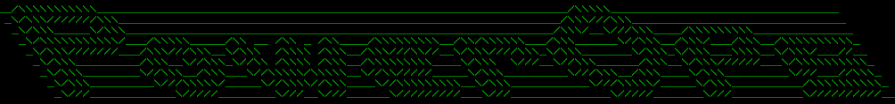

Copyright © 2017 VMware, Inc. All Rights Reserved.
SPDX-License-Identifier: MIT
# NSX Power Operations - An NSX-v Operationalization Project

### Overview
NSX Power Operations is a platform that provides NSX users a way to document their VMware NSX for vSphere environment in Microsoft Excel and Visio files that are easily consumable and referable. The documentation not only captures the Desired State (configuration) but also the Realized State (for example: routing & forwarding tables) across the distributed environment. The platform also embeds rich health check tools.

### Releases & Major Branches
Current version: 2.0

### Documentation

* [PowerOps Documentation - VCDX248](http://www.vcdx248.com/)

### Prerequisites

#### Required Pre-Requisites:

1. [PowerShell 5.1 - KB3191564](https://support.microsoft.com/en-us/help/3191564/update-for-windows-management-framework-5-1-for-windows-8-1-and-window)
2. [VMware PowerCLI](https://code.vmware.com/web/dp/tool/vmware-powercli/)
    * To install from [PowerShell Gallery](https://www.powershellgallery.com/) execute the following commands in a PowerShell terminal:
        * `Install-Module -Name VMware.PowerCLI`
        * `Install-Module -Name VMware.VimAutomation.Sdk`
3. [Microsoft Excel](https://products.office.com/en-us/excel) - Must be installed locally and tested to work with Office 365 installations
4. Access to NSX Manager API with Read Privileges
5. Access to vSphere Web Client with Read Privileges
6. [VMware PowerNSX](http://powernsx.github.io)
    * NSX Power Operations automatically installs this module
    * To install from [PowerShell Gallery](https://www.powershellgallery.com/) execute following commands in a PowerShell terminal:
        * `Install-Module -Name PowerNSX`
7. Pester (NSX Power Operations automatically install this module)
    * [Pester - PowerShell's Testing Framework Module - Manual Install Steps:](http://www.powershellmagazine.com/2014/03/12/get-started-with-pester-powershell-unit-testing-framework/)
    * High-level steps:
     * Right click on the zip file and hit properties. Click Unblock. Do it before unzipping to save time.
        * Extract the file and put the folder under: `C:\Program Files (x86)\VMware\Infrastructure\PowerCLI\Modules\Pester` such that all are under folder Pester in the Modules directory.
     * Run PowerCLI as Administrator and execute following commands
         * `Get-Module -ListAvailable -Name Pester`
         * `Import-Module Pester`
         * `Get-Module -Name Pester | Select -ExpandProperty ExportedCommands`
8. Posh-SSH (NSX Power Operations automatically install this module)
    * Posh-SSH - PowerShell's SSH Module - Manual Install Steps:
        * Option 1:
            * Run PowerCLI as Administrator and execute: 
            `iex (New-Object Net.WebClient).DownloadString("https://gist.github.com/darkoperator/6152630/raw/c67de4f7cd780ba367cccbc2593f38d18ce6df89/instposhsshdev")`
        * Option 2:
            * Download the [Module](https://github.com/darkoperator/Posh-SSH/archive/master.zip)
            * Extract the files under `C:\Program Files (x86)\VMware\Infrastructure\PowerCLI\Modules\Posh-SSH` such that all the files are under folder Posh-SSH in the Modules directory
            * Run PowerCLI as Administrator and execute following commands
                * `Get-Module -ListAvailable -Name Posh-SSH`
                * `Import-Module Posh-SSH`
                * `Get-Module -Name Posh-SSH | Select -ExpandProperty ExportedCommands`

#### Optional Pre-Requisites:

* [Git Local Installation](https://git-scm.com/)
* [Microsoft Visio 2016 - Std/Pro](https://products.office.com/en-us/visio)
    * **Note**: Not supported with Trial or Office 365 installations of Microsoft Visio

### Download via git
    
To download via Git, execute the following command on the CLI:

`git clone https://github.com/vmware/nsx-powerops.git`

### Build & Run

**Note**: For PowerCLI to work correctly, ensure you have the Execute Policy set correctly. Execute the following command: `Set-ExecutionPolicy RemoteSigned` in a Administrative PowerShell session.

To run PowerOps:

1. Run the `./nsx-PowerOps.ps1` in PowerShell terminal
2. When in `nsx-PowerOps.ps1`:
    * To get help type `h`
    * To return to previous menu type `x`
    * To quit the program type `q`
3. Install NSX Power Operations dependencies (PowerNSX, Pester, Posh-SSH) by selecting option # `1`
4. Connect with NSX Manager and vCenter by selecting option # `2`

### Contributing
The NSX-PowerOps project team welcomes contributions from the community. Before you start working with NSX-PowerOps, please read our [Developer Certificate of Origin](https://cla.vmware.com/dco). All contributions to this repository must be signed as described on that page. Your signature certifies that you wrote the patch or have the right to pass it on as an open-source patch. For more detailed information, refer to the [Contribution Guidelines](CONTRIBUTING.md).

### License
NSX Power Operations

Copyright 2017 VMware, Inc.  All rights reserved                

The MIT license (the ìLicenseî) set forth below applies to all parts of the NSX Power Operations project.  You may not use this file except in compliance with the License.†

MIT License

Permission is hereby granted, free of charge, to any person obtaining a copy of this software and associated documentation files (the "Software"), to deal in the Software without restriction, including without limitation the rights to use, copy, modify, merge, publish, distribute, sublicense, and/or sell copies of the Software, and to permit persons to whom the Software is furnished to do
so, subject to the following conditions:

The above copyright notice and this permission notice shall be included in all copies or substantial portions of the Software.

THE SOFTWARE IS PROVIDED "AS IS", WITHOUT WARRANTY OF ANY KIND, EXPRESS OR IMPLIED, INCLUDING BUT NOT LIMITED TO THE WARRANTIES OF MERCHANTABILITY, FITNESS FOR A PARTICULAR PURPOSE AND NONINFRINGEMENT. IN NO EVENT SHALL THE AUTHORS OR COPYRIGHT HOLDERS BE LIABLE FOR ANY CLAIM, DAMAGES OR OTHER LIABILITY, WHETHER IN AN ACTION OF CONTRACT, TORT OR OTHERWISE, ARISING FROM, OUT OF OR IN CONNECTION WITH THE SOFTWARE OR THE USE OR OTHER DEALINGS IN THE SOFTWARE.

### Notice
NSX Power Operations

Copyright (c) 2017 VMware, Inc. All Rights Reserved. 

This product is licensed to you under the MIT license (the "License").  You may not use this product except in compliance with the MIT License.  

This product may include a number of subcomponents with separate copyright notices and license terms. Your use of these subcomponents is subject to the terms and conditions of the subcomponent's license, as noted in the LICENSE file. 

### Contact Info
Puneet Chawla (cpuneet@vmware.com) and Hammad Alam (halam@vmware.com)
